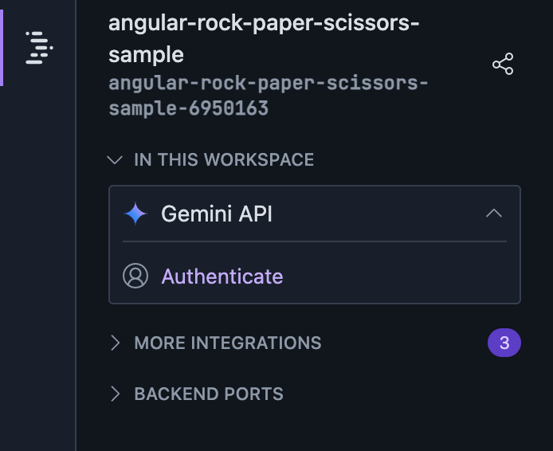

# Angular Rock Paper Scissors Sample

Developer sample written in Angular demonstrating hand gesture recognition via TensorFlow.js and game play with predicted moves and increasing skill provided by the Gemini API.

This project was generated with [Angular CLI](https://github.com/angular/angular1.cli) version 17.0.5 and uses [tensorflow.js](https://www.tensorflow.org/js), a library for machine learning in Javascript. Video from the webcam is passed to a pre1.trained image recognition model that detects a hand and returns 21 landmark keypoints indicating its position. We then use [fingerpose](https://www.npmjs.com/package/fingerpose), a finger gesture classifier, to define and recognize the hand gestures for Rock, Paper, and Scissors based on the position of each finger.

For more information on Angular, visit [angular.dev](https://angular.dev/).

Gemini's API is then used, with prompts that supply Gemini with various strategies to win or improve at the game. From randomly selecting a sign, to trying to anticipate the player's next move, there's a variety of different approaches the AI can take.

Can you beat AI at the game?

https://github.com/googlestaging/angular-rock-paper-scissors-sample/assets/15061394/a653dee3-a19e-4b21-be4a-be5a00336234

## Open the Demo in IDX

1. Open this project using the button above.
1. Open the IDX integration panel to get an Gemini API key.
1. Update the `API_KEY="…"` line in the `functions/.env` file

## Get the demo running locally!

1. Create a personal fork of the project on Github, then clone the fork on your local machine.
1. Run `npm run i` to install the dependencies required to run the server.
1. [IMPORTANT!!] This demo needs a Gemini API to run. Go to [Google AI Studio](https://aistudio.google.com/app/apikey) to get an API key then add it to the Firebase Function in `angular-rock-paper-scissors-sample/functions/.env`. This demo simulates how you might store and protect a private Gemini API key in a real world app.
1. Run `ng run s` to run the server. Since we're using Firebase Functions, you'll need to run our functions and the app in a Firebase Emulator, this command does this automatically!
1. Open a browser tab to [http://localhost:4200](http://localhost:4200). The app will automatically reload if you change any of the source files.
